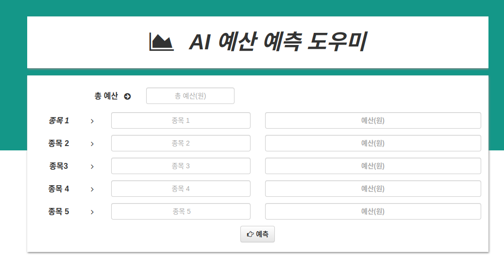
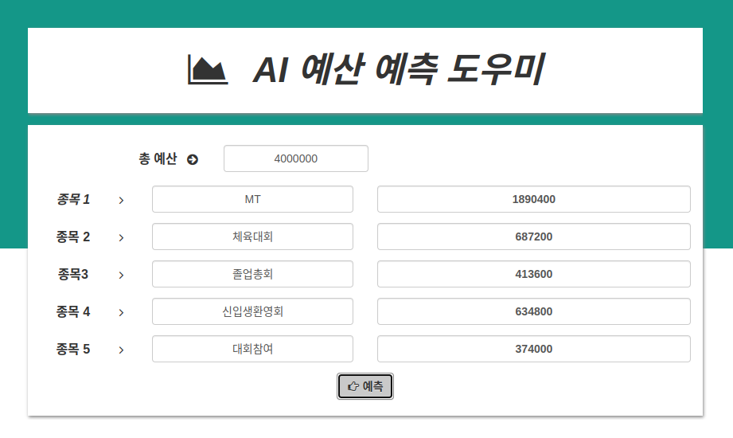

# Budget_Predict_AI
### __주의!__ Test_Budget.py를 쓰기 위해서, 동봉된 AutogluonModel2.zip파일을 Test_Budget.py이 있는 폴더 위치에 압축풀기를 해야합니다.

## 1. 개요
이번에 만든 AI 모델은 Autogluon을 활용한 __"마이 데이터를 바탕으로 예산을 예측하는 AI 모델, BuPA(Budget Predict AI)__ 입니다. 
Autogluon을 활용하여, 이전까지 사용한 예산 데이터를 바탕으로, 현재 배당해야할 예산을 자동으로 예측해주는 모델입니다. 
가장 큰 장점으로, 모델을 정할 필요 없이, Autogluon API를 활용하여, 여러 모델을 한번에 학습하고, 가장 성능이 좋은 모델을 뽑아내, 모델 결정의 수고를 덜 수 있습니다. 
또한, CPU, GPU(구글 Colab 무료 버전)만으로도 학습이 가능한 가벼운 모델(?)이라는 점이 크다. (3G)  
따라서, 적은 컴퓨팅 성능을 요구하면서, 빠르게 예측을 돌릴 수 있는 모델입니다. 

## 2. AutoGluon
아마존에서 만든 머신러닝 자동화 오픈소스 Toolkit.  
회귀, 분류, 이미지 예측 등에서 사용이 가능, __모델을 선택할 필요가 없이__, ML모델을 만들 수 있고, 특정모델에 관한 학습도 가능 
CatBoost, RandomForest, LightGBM, ExtraTree, XGBoost 등의 예측 모델 알고리즘을 한번에 학습하고, 그 중, 가장 성능이 좋은 모델을 선택 혹은 앙상블을 할 수 있다. 
Autogluon은 학습 시, Tabular데이터셋을 활용해야 한다. 

## 3. 예측 과정
#### 1) 데이터베이스를 불러오기
* 먼저 데이터셋을 불러온다. 또한, 불러오는 과정에서 필요없는 열 __"Unnamed: 0"__ 를 삭제한다 

* 그 후, 데이터셋 중, '종목'열에 있는 문자열들을 숫자로 바꿔주는 Event_Labeling함수를 정의한다.

* 예측을 위해서, 데이터셋에 있는 것 중, 이전 예산 데이터를 뽑아와서, DataFrame으로 제작 후, Event_Labeling, 스케일링으로 데이터를 정리한다.그 후, Autogluon모델에 넣을 수 있도록, TabularDataset으로 재정의한다.

#### 2) 예측 프로그램을 실행
* 이제 예측을 한 후, 예측값을 기준으로, 비율을 측정한 후, 총 예산에 맞게 재수정을 한 후, 반환하게 된다.
* 이는 Anvil Web App에서 불러오는 함수이기 때문에 실제 파이썬 파일에서는 예측값을 보여주지는 않는다.

#### 3) Anvil Web APP
* 파이썬 실행 시, 나오는 Anvil Webpage URL을 들어가면 다음과 같은 화면을 볼 수 있다.

* 여기에 __총예산(숫자), 종목 5개__ 를 입력 후, 버튼을 누르면, 예측 결과를 냄을 확인할 수 있다.

## 4. 결론
* 가장 먼저, 예측에 필요한 데이터로, 다른 요소를 넣지 않고 오로지 과거의 데이터로만 예측할 수 있으므로, 물가 인플레이션 등을 고려하지 못하는 것은 아쉽다.
* 실제로 서비스 할 때엔 다음과 같은 요소를 추가로 고려해서 예측을 내는 모델을 만들 것이다.
